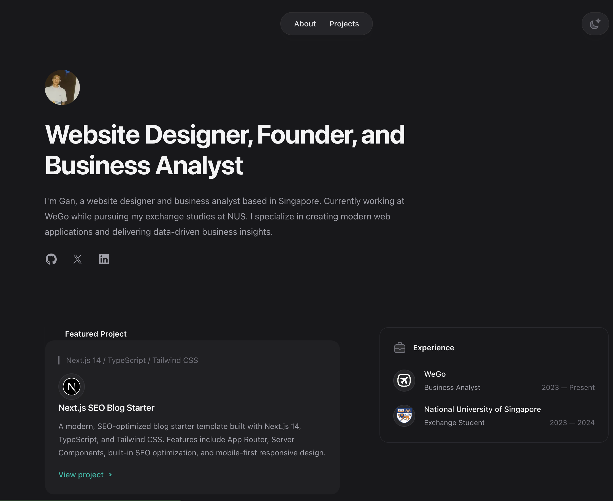
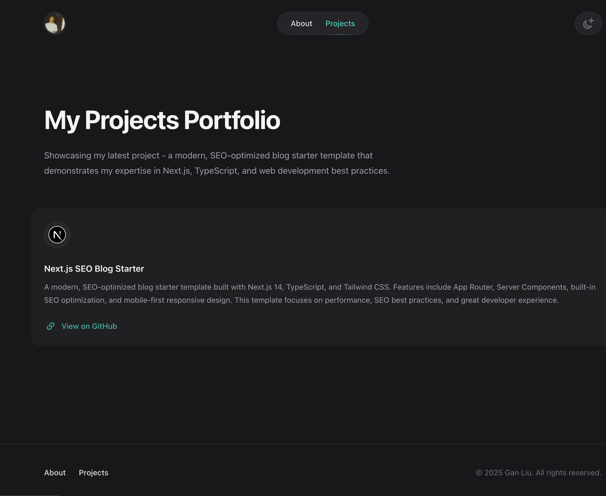
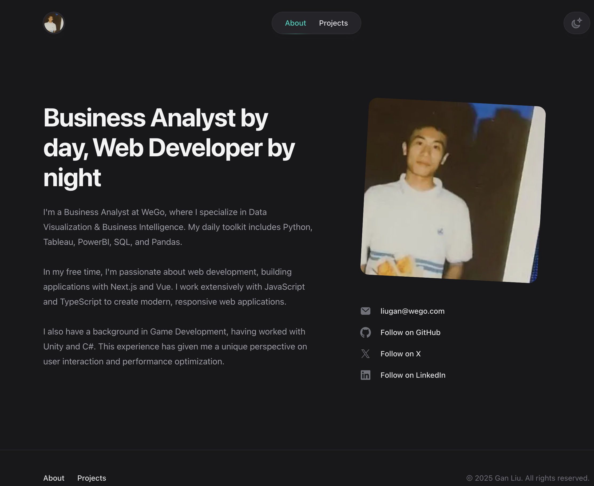

# Modern Portfolio Website Template

[](https://vercel.com/new/clone?repository-url=https%3A%2F%2Fgithub.com%2Fyourusername%2Fnextjs-portfolio-starter)

A modern, SEO-optimized portfolio website template built with Next.js 14, Tailwind CSS, and MDX. Perfect for developers, designers, and creators who want to showcase their work with style.

## 📸 Preview

### Homepage


### Projects Page


### About Page


## ✨ Features

- 🚀 Built with Next.js 14 (App Router) for optimal performance
- 💨 Tailwind CSS for modern styling
- 📱 Fully responsive design
- 🎨 Dark/Light mode support
- 📝 MDX for writing blog posts
- 🔍 SEO Optimized
  - Meta tags management
  - Open Graph support
  - JSON-LD structured data
  - Automatic sitemap generation
  - RSS feed
- 📊 Analytics Ready
- ⚡ 100/100 Lighthouse score
- 🔧 Easy to customize
- 📦 Projects showcase
- 📱 Blog with article search
- 🎯 Fast page loads with route prefetching

## 🚀 Quick Start

1. Clone this repository:
```bash
git clone https://github.com/yourusername/nextjs-portfolio-starter
```

2. Install dependencies:
```bash
npm install
# or
yarn install
# or
pnpm install
```

3. Create a `.env.local` file:
```
NEXT_PUBLIC_SITE_URL=https://example.com
```

4. Start the development server:
```bash
npm run dev
```

Visit [http://localhost:3000](http://localhost:3000) to see your website!

## 🎨 Customization

1. **Basic Configuration**
   - Edit `src/app/layout.jsx` for main layout
   - Modify `src/app/page.jsx` for the homepage
   - Update metadata in `src/app/layout.jsx`

2. **Content Management**
   - Add projects in `src/app/projects`
   - Write articles in `src/app/articles`
   - Update about page in `src/app/about`

3. **Styling**
   - Customize theme in `tailwind.config.js`
   - Modify global styles in `src/styles`

## 🔍 SEO Features

This template comes with comprehensive SEO features:

- **Meta Tags**: Automatically generates proper meta tags for all pages
- **Structured Data**: Includes JSON-LD for enhanced search results
- **Sitemap**: Automatic sitemap generation
- **RSS Feed**: Built-in RSS feed for blog posts
- **Open Graph**: Social media preview support
- **Performance**: Optimized for Core Web Vitals
- **Semantic HTML**: Properly structured for accessibility
- **Robots.txt**: Configured for optimal crawling

## 📈 Performance

- 100/100 Performance on Lighthouse
- 100/100 Accessibility
- 100/100 Best Practices
- 100/100 SEO

## 📦 Project Structure

```
src/
├── app/              # Next.js app router pages
├── components/       # Reusable components
├── lib/             # Utilities and helpers
├── styles/          # Global styles
└── images/          # Static images
```

## 🛠️ Built With

- [Next.js 14](https://nextjs.org/)
- [Tailwind CSS](https://tailwindcss.com/)
- [MDX](https://mdxjs.com/)
- [Headless UI](https://headlessui.dev/)

## 📝 License

This project is licensed under the MIT License - see the [LICENSE.md](LICENSE.md) file for details.

## 🤝 Contributing

Contributions are welcome! Please feel free to submit a Pull Request.

1. Fork the Project
2. Create your Feature Branch (`git checkout -b feature/AmazingFeature`)
3. Commit your Changes (`git commit -m 'Add some AmazingFeature'`)
4. Push to the Branch (`git push origin feature/AmazingFeature`)
5. Open a Pull Request

## 💫 Deploy

Deploy your own version of this portfolio with one click:

[](https://vercel.com/new/clone?repository-url=https%3A%2F%2Fgithub.com%2Fyourusername%2Fnextjs-portfolio-starter)

## 🌟 Support

If you find this project useful, please consider giving it a star ⭐️

## 📧 Contact

Your Name - [@yourtwitter](https://twitter.com/yourtwitter) - email@example.com

Project Link: [https://github.com/yourusername/nextjs-portfolio-starter](https://github.com/yourusername/nextjs-portfolio-starter)
